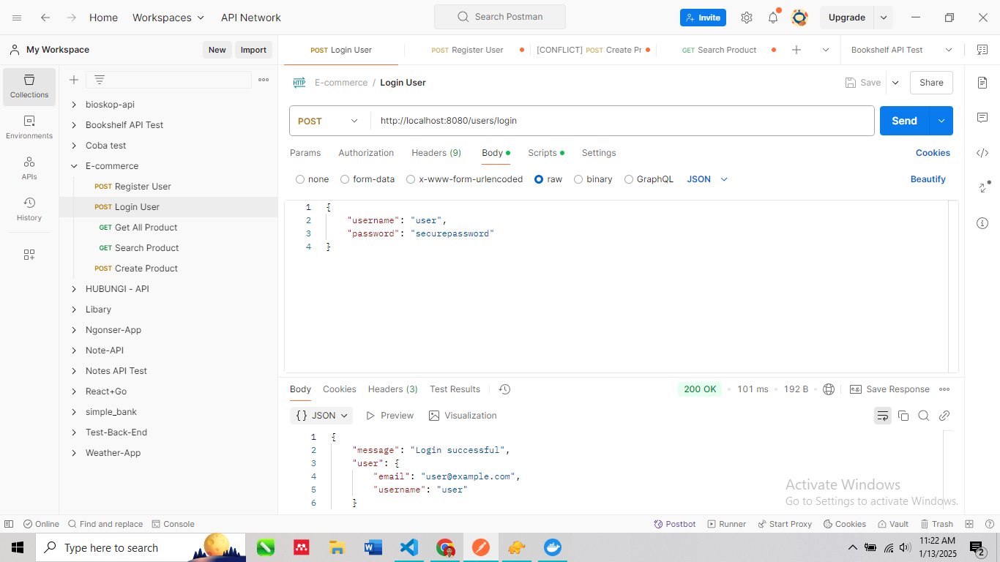
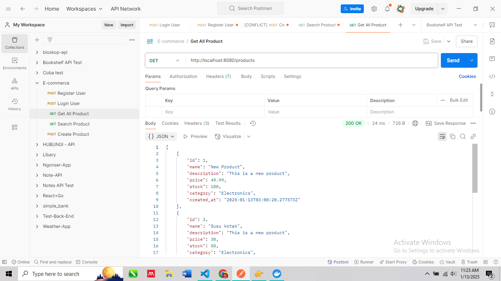
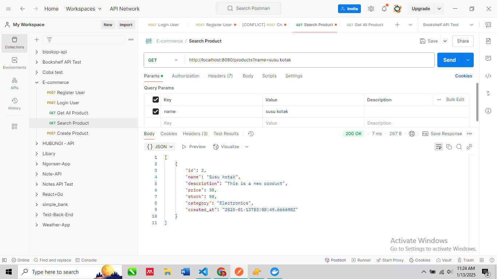

# E-Commerce API

This is a simple back-end API for an e-commerce platform built using Go (Golang) and PostgreSQL. The API includes features such as user authentication, product search, shopping cart management, and order completion.

## Features

- **User registration and authentication**
- **Viewing and searching products**
- **Adding items to a shopping cart**
- **Completing a purchase**

## Requirements

- Go (Golang)
- PostgreSQL database
- Postman or any API client for testing

## Setup

### 1. Clone the Repository
First, clone the repository to your local machine:

```bash
git clone https://github.com/yourusername/ecommerce-api.git
cd ecommerce-api
```

### 2. Setup the Database
You need to create a PostgreSQL database and tables as mentioned below.

1. Create a database called `ecommerce_api`.
2. Run the following SQL scripts to set up the necessary tables:

#### **Products Table**

```sql
CREATE TABLE products (
    id SERIAL PRIMARY KEY,
    name VARCHAR(255),
    description TEXT,
    price DECIMAL(10, 2),
    stock INT,
    category VARCHAR(255)
);
```

#### **Carts Table**

```sql
CREATE TABLE carts (
    id SERIAL PRIMARY KEY,
    user_id INT NOT NULL,
    created_at TIMESTAMP DEFAULT CURRENT_TIMESTAMP
);
```

#### **CartItems Table**

```sql
CREATE TABLE cart_items (
    id SERIAL PRIMARY KEY,
    cart_id INT NOT NULL,
    product_id INT NOT NULL,
    quantity INT DEFAULT 1,
    FOREIGN KEY (cart_id) REFERENCES carts (id),
    FOREIGN KEY (product_id) REFERENCES products (id)
);
```

#### **Orders Table**

```sql
CREATE TABLE orders (
    id SERIAL PRIMARY KEY,
    user_id INT NOT NULL,
    total_price DECIMAL(10, 2),
    created_at TIMESTAMP DEFAULT CURRENT_TIMESTAMP
);
```

#### **OrderItems Table**

```sql
CREATE TABLE order_items (
    id SERIAL PRIMARY KEY,
    order_id INT NOT NULL,
    product_id INT NOT NULL,
    quantity INT,
    price DECIMAL(10, 2),
    FOREIGN KEY (order_id) REFERENCES orders (id),
    FOREIGN KEY (product_id) REFERENCES products (id)
);
```

### 3. Environment Variables

Create a `.env` file in the root directory of the project and add your PostgreSQL credentials:

```
POSTGRES_HOST=localhost
POSTGRES_PORT=5432
POSTGRES_USER=yourusername
POSTGRES_PASSWORD=yourpassword
POSTGRES_DATABASE=e-commerce
```

### 4. Run the Application

Make sure Go is installed on your system. Then, run the application with:

```bash
go run main.go
```

By default, the server will run on port `8080`. You can change the port in the code if needed.

### 5. API Endpoints

#### **1. User Registration and Authentication**

- **POST /users/register** - Register a new user.
- **POST /users/login** - Login with username and password to get a JWT token.
 

#### **2. Product Management**

- **GET /products** - Get a list of all products.
   
- **GET /products/search** - Search products by name and/or category.
   

#### **3. Cart Management**

- **POST /cart/add** - Add an item to the cart.
- **GET /cart** - View the user's current cart.

#### **4. Completing a Purchase**

- **POST /purchase** - Complete the purchase and place an order.

## Testing with Postman

You can use Postman to test the API endpoints:

1. **Register a User** (POST /auth/register)
2. **Login the User** (POST /auth/login)
3. **View Products** (GET /products)
4. **Search Products** (GET /products/search)
5. **Add Item to Cart** (POST /cart/add)
6. **Complete Purchase** (POST /purchase)

Ensure you have the correct authorization (JWT) when performing actions that require authentication, such as adding to the cart or completing a purchase.

## Contributing

Feel free to fork the repository, make improvements, and create a pull request!

## License

This project is open-source and available under the MIT License.
